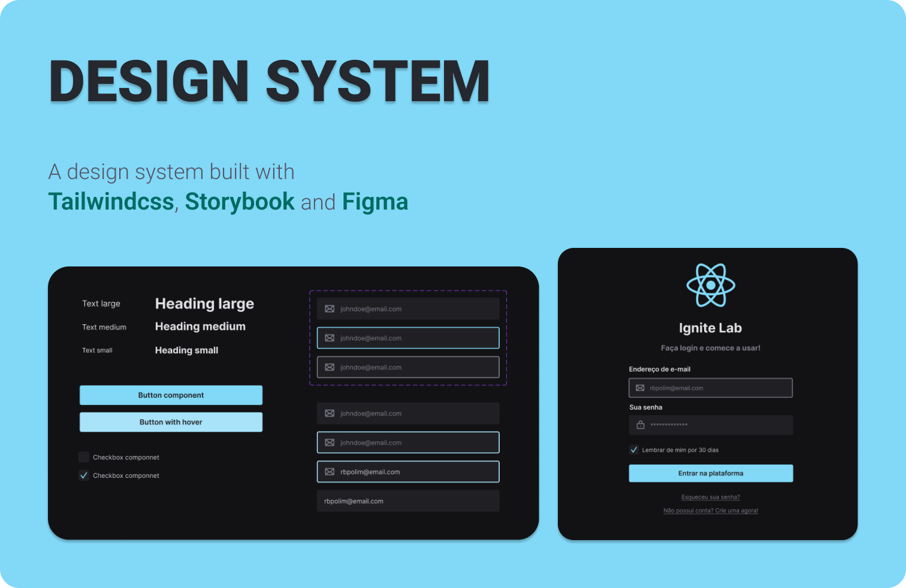

<!-- Logotipo -->
<div align="center">
  
</div>

<!-- Logo -->
<h1 align="center"> Design System - Ignite Lab </h1>
<!-- Sobre o Projeto -->

## 🧐 Sobre o Projeto

Esse projeto é foi construído durante o evento IgniteLab, onde foi abordado o tema de Design Systems. Foi utilizado storybook para documentação.

## 🔥 Preview

Acesse o link: https://lucasbarque.github.io/DesignSystemIgniteLab/?path=/story/components-button--default

## 🚀 Tecnologias e Bibliotecas

- [ReactJS](https://reactjs.org/)
- [Vite](https://vitejs.dev/)
- [TailwindCSS](https://tailwindcss.com/)
- [Storybook](https://storybook.js.org/)

## 💻 Rodando o Projeto

```bash
# Realize o Clone deste repositório e acesse a pasta do projeto.
# Instale as dependências
$ yarn install
ou
$ npm install
# Executando o Projeto
$ yarn dev
ou
$ npm run dev
# Acesse http://localhost:3000 no seu navagador
```
